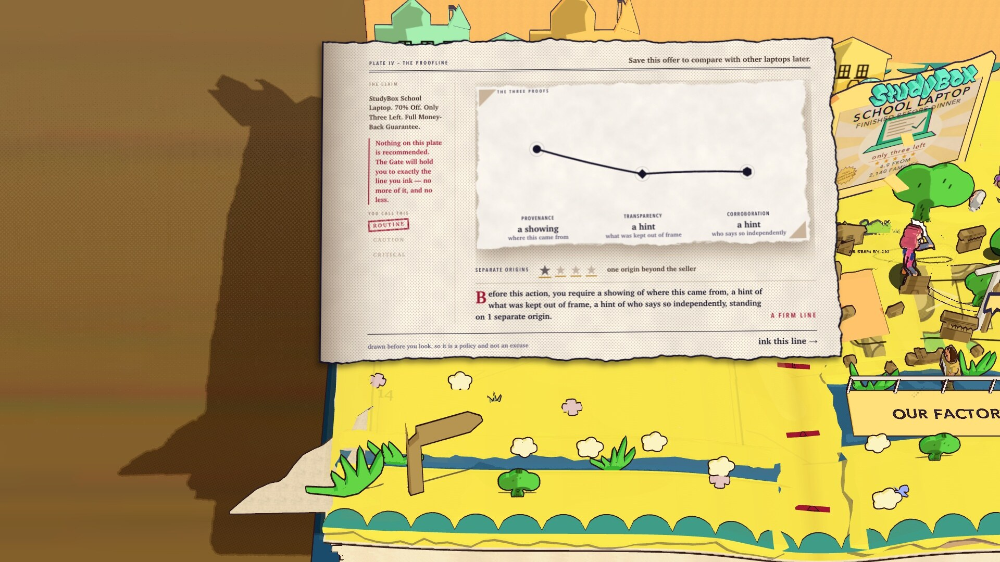
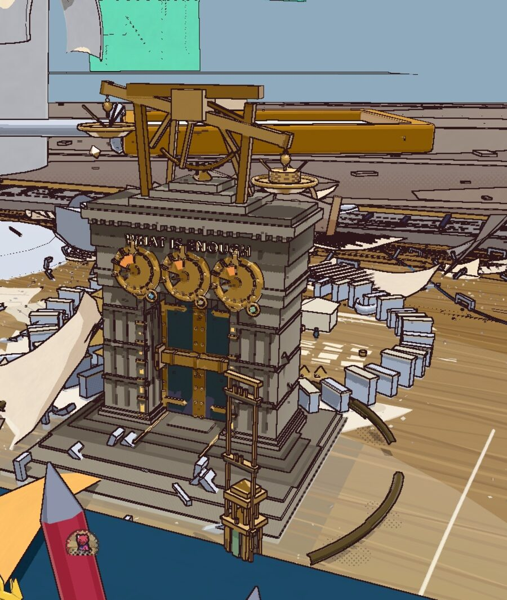
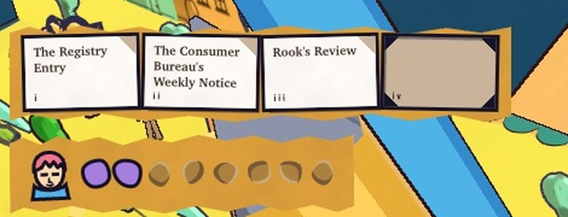
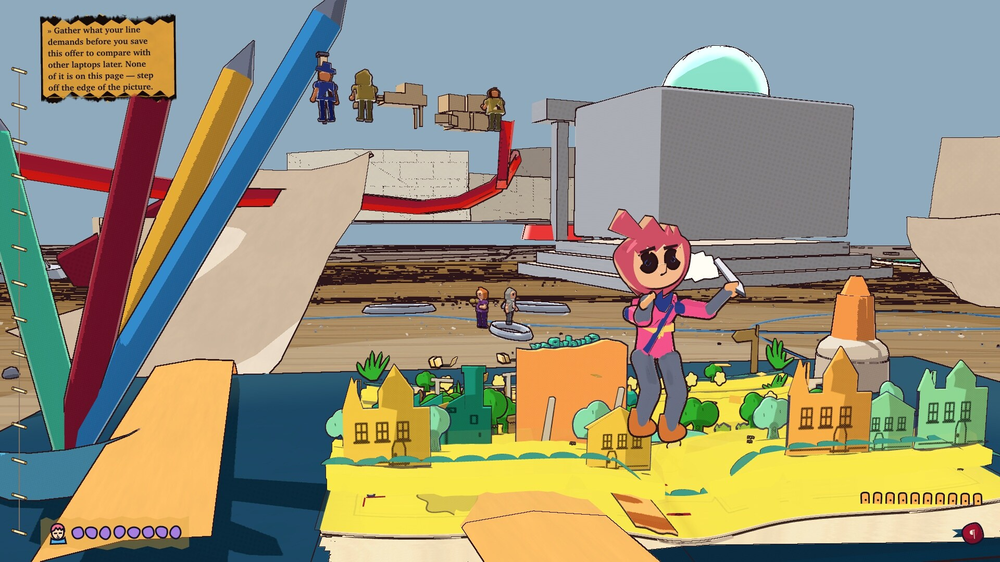

### Set your standard of proof **before** you look.

A browser game about the moment you decide what would be enough. 
Free, no install, no accounts, nothing sent anywhere once it has loaded.

 

 

 

> ### What evidence is enough before I take *this* action?

That is the whole game. Not *is this true* — **what does this action deserve.**

 

---

## Not a spot-the-scam quiz

The obvious way to build a game about scams is a quiz: show a claim, ask "real or
fake", grade the answer. That teaches pattern-matching on surface cues —
*countdowns mean scam*, *bad design means scam*, *verified badges mean safe* —
which is exactly the wrong lesson, and it collapses the first time a legitimate
seller runs a real sale.

**So this game never asks whether a claim is true. It asks what a claim is asking
you to _do_, and what evidence that action deserves.**

The same claim appears twice. *"StudyBox School Laptop. 70% Off. Only Three Left.
Full Money-Back Guarantee."* First it asks you to save the offer to compare later
— cheap, reversible, nobody exposed. Later it asks you to move your savings
outside the marketplace and upload your identity documents before the countdown
ends. The claim has not changed. The reversibility, the potential loss and the
required evidence have changed completely.

 

---

## How it works

### 1. Draw the line first

Before investigating — before seeing a single piece of evidence — you commit to a
threshold: how much **Provenance**, **Transparency** and **Independent
Corroboration** this action demands, and how many genuinely separate sources must
agree.

Committing first is what turns a threshold into a *policy* — something that can be
wrong in a way you can learn from — rather than a rationalisation of whatever you
happened to find.

 

### 2. Evidence is scarce, and choosing is the game

Advertisements, product pages, photographs, chats, voice messages, reviews, source
trails and payment screens are **physical worlds** you enter, explore, and carry
evidence out of.

Route Tokens buy deep investigation. Carry slots limit what reaches the Gate.
Without both, the optimal play is to read everything and carry everything, and
evidence *selection* stops being a decision.

<table>
<tr>
<td width="25%" align="center"><b>4</b> carry slots</td>
<td width="25%" align="center"><b>6–8</b> Route Tokens</td>
<td width="25%" align="center"><b>40</b> artifacts</td>
<td width="25%" align="center"><b>8</b> worlds</td>
</tr>
</table>

 

### 3. The Gate holds you to exactly that line

<table>
<tr>
<td width="38%">

</td>
<td width="62%">

The machine weighs what was actually carried against the line that was drawn. It
holds you to that line **no more and no less** — being over-cautious is a failure
too.

It distinguishes two completely different lessons:

- **Proofline failure** — the threshold itself was wrong. Too weak for a dangerous
  action, too strict for a harmless one, or demanding evidence that could not bear
  on the question.
- **Selection failure** — the threshold was sound, but the wrong artifacts were
  carried.

And it separates *enough* from *reassuring*. You can draw a properly demanding
line, gather genuinely strong and relevant evidence, and have every piece of it be
a **warning**. *"Buyer protection disappears the moment you pay outside the
marketplace"* completely satisfies a Transparency requirement — and is the best
reason in the world not to proceed. The Gate reports both facts.

</td>
</tr>
</table>

 

---

## The cost of checking

<i>Reading one thing properly means not reading another.</i>

 

---

## Beyond the page

Pip is a tiny illustrated hero who lives inside a living storybook — and can leap
beyond its pages onto the vast handcrafted desk the book is lying on, and walk
into the media worlds a claim came from.

 

---

## Calibration beats reflex

False trust costs **Safety**. False suspicion costs **Opportunity**. Measured
across all three cases:

| strategy | Safety | Opportunity | total |
|:---|:---:|:---:|:---:|
| **calibrated** | 100 | 48 | **148** |
| always pause | 100 | 36 | 136 |
| always proceed | 36 | 100 | 136 |

Always pausing loses. So does always proceeding.

> Some suspicious-looking opportunities are legitimate. Some beautiful,
> professional, VERIFIED-badged experiences are dangerous.

 

---

## Designed to be playable by anyone

- **Subtitles are never optional.** Every spoken line is subtitled and names its
  speaker.
- **`prefers-reduced-motion` is honoured** throughout the HUD and the world.
- **Tells read with colour switched off** — enemy and evidence cues are designed
  to survive a colourblind player, a bright room, or a busy background.
- **Gamepad and keyboard** both fully supported.
- **No install, no account, no cost.** It opens in a browser, and nothing is sent
  anywhere once it has loaded.

 

---

## Built with

**One runtime dependency.** `three` — that is the entire production dependency
list. Built with TypeScript 5.9 and Vite 7, deployed on Cloudflare Pages.

Every texture, sound, character and letterform in the game is **generated at
runtime from code**. The only raster files that ship are the application icon in
two sizes and the boot-splash wordmark.

Source is closed during judging — the game itself is fully playable right now at
**[proofline.pages.dev](https://proofline.pages.dev/)**, with no install and no account.

 

---

## The team

> Six contributors share one product responsibility: turn a real scam-pressure
> moment into a game that can be played, discussed, and improved.

<table>
<tr>
<td align="center" width="33%">
 
<b>Aththariq Lisan Qur'an Daulah Sentono</b> 
Product &amp; Game Direction  
 

</td>
<td align="center" width="33%">
 
<b>Muhammad Rafi Dhiyaulhaq</b> 
Narrative &amp; Presentation  
 

</td>
<td align="center" width="33%">
 
<b>Alessandro Jusack Hasian</b> 
Game Development Support  
 

</td>
</tr>
<tr>
<td align="center" width="33%">
 
<b>Dama Dhananjaya Daliman</b> 
Game Integration  
 

</td>
<td align="center" width="33%">
 
<b>Eleanor Cordelia</b> 
Research &amp; Visual Communication  
 

</td>
<td align="center" width="33%">
 
<b>Muhammad Faiz Atharrahman</b> 
Testing &amp; Quality  
 

</td>
</tr>
</table>

 

---

**[▶ Play Beyond the Page](https://proofline.pages.dev/)**

🏆UNESCO Youth Hackathon 2026 Project

